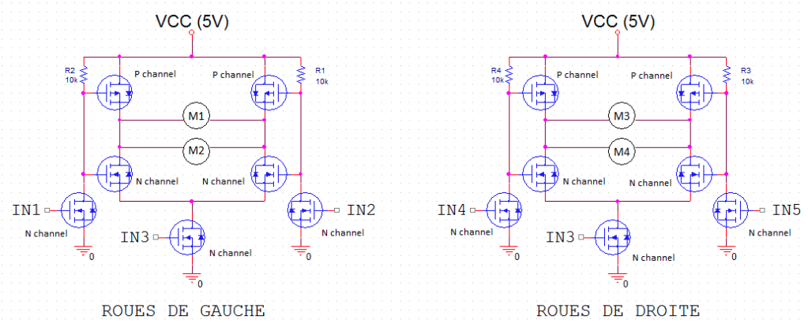

# iReboot
iReboot is a little raspberry project to pilote a robot. We design this project with a friend during our engineer school. The robot is remote by iOS in Wifi.


##Architecture
The project is very simple : the nodeJS server is running on a Raspberry-pi. Motors are remoted using the gpio of the rasp.

Then a iOS app talk with the nodeJS server to drive the robot.

##Electronic


Here is the scheme for both side. We have 4 motors each one for one wheel. Their speed is the same side by side. The robot can change direction like a Tank.

On the scheme IN1(4), IN2(5) aim to code the rotation : backward or forward. The IN3 (which is different for both side) aim to control the speed rotation. Each IN is plug to a gpio on the raspberry plus the ground pin.

Actually, the scheme is more simple. We don't have a bridge to pilote motors foreward and backward. We only have a PWM to set the motor speed.

##System
###Pins
TODO
###Configure the Pi with Wifi
cf source
###Crontab
We have to create a crontab to run the server and everything. Since we have a problem to start the server (the PWM doesn't work before having set the pin in "OUT" mode), i decided to run a little script to move the robot a little bit. It also permit to know when the robot is ready.

Also don't forget to create a folder "log" at yout home path.

```
@reboot sudo service isc-dhcp-server start
@reboot sudo sh /home/pi/initGpio.sh > /home/pi/log/log
@reboot sudo node /home/pi/nodeJS/server.js >/home/pi/log/node_log

```

##NodeJS
In the NodeJS part there are two parts :

###The server part

Here we get the data and the actions from the iOS app and tell it to the motors part. We can also stop the raspberry and start a camera session. We use Socket.io and websocket to communicate between the server and the iOS app.

###The motors part
This part aim to remote the motors from the data of the server class. It also init the motors.

##iOS part
TODO
